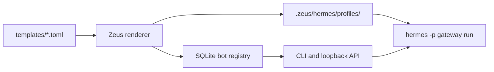

<p align="center">
  
</p>

# Zeus Hermes Orchestrator

Many Hermes bots, one local supervisor.

[](https://github.com/brainx/zeus/actions/workflows/ci.yml)
[](pyproject.toml)
[](LICENSE)
[](https://github.com/brainx/zeus/releases)
[](.github/workflows/ci.yml)
[](SECURITY.md)

Zeus is an orchestration layer for running many Hermes Agent bots from reusable templates. It renders each bot as an isolated Hermes profile under `.zeus/`, starts and stops gateway processes, tracks PID ownership, and exposes a small loopback CLI/API for operators.

## Why Zeus

- Run multiple Hermes bots from one workspace without hand-copying profile directories.
- Stamp out repeatable bot shapes from TOML templates: coding, research, support, DeepSeek, and custom profiles.
- Keep secrets out of templates by rendering per-profile `.env` files that stay ignored by git.
- Supervise gateway processes with ownership markers before stop/status actions trust a PID.
- Account for Hermes async delegation with explicit `max_async_children` caps in every built-in template.
- Verify locally, against a real Hermes install, or on a clean Debian/Ubuntu VPS using included scripts.

## How It Works



Each rendered profile contains `config.yaml`, `.env`, `SOUL.md`, `mcp.json`, `cron/jobs.json`, and logs. Hermes remains the agent runtime; Zeus owns profile generation, local orchestration, lifecycle checks, and handoff verification.

## Zeus and Olymp

Zeus owns host-local Hermes profiles, processes, lifecycle safety, and reconciliation evidence.
[Olymp](https://github.com/brainx/olymp) is the separate BrainX control-plane project for
cross-host coordination, rollout policy, and approvals. Zeus deliberately does not make
cluster-wide placement or rollout decisions; Olymp can consume Zeus' local API and persisted
run summaries at that boundary.

## Quick Start

### 1. Credential-free offline demo

The fastest first success needs neither Hermes nor provider credentials. From a
checkout:

```bash
python3 -m venv .venv
. .venv/bin/activate
python -m pip install -e .

zeus demo up
zeus demo status
zeus demo down
```

The demo uses Zeus' packaged fake-Hermes executable and stores its disposable
runtime under `ZEUS_STATE_DIR` (the workspace-local `.zeus/` directory by
default). It exercises real profile rendering and process lifecycle behavior
without contacting a provider.

### 2. Real Hermes setup

Check the installed Hermes version, then prepare a private workspace secret
file:

```bash
hermes version
cp .env.example .env
chmod 0600 .env
```

`.env.example` contains empty placeholders and is not ready to import. Stop here
until `.env` contains a real, non-empty provider key required by the selected
template, such as `OPENROUTER_API_KEY` for `coding-bot`. As an alternative,
provide the same named secret through a secure process-environment mechanism.

Then validate Zeus and render the real Hermes profile:

```bash
zeus doctor
zeus template list
zeus bot create coder --template coding-bot --env-from OPENROUTER_API_KEY
zeus bot doctor coder
```

`--env-from NAME` imports a named value from the process environment first and
then the trusted workspace `./.env`; the value never enters the Zeus argument
list or command output. A present but empty process value is an error and does
not fall back to `.env`. Keep the workspace `.env` private with `chmod 0600 .env`.
The legacy `--env NAME=VALUE` form remains available
for non-secret compatibility values, but is unsafe for secrets because command
arguments can be retained in shell history and exposed in process listings.

Safety model: Zeus is a local process orchestrator, not a sandbox. Use Docker or
another Hermes terminal backend for untrusted tasks. Do not expose the API
directly to a network; keep it on loopback or behind a separately hardened
access layer. Logs and audit events may contain sensitive operational data, so
protect and rotate `$ZEUS_STATE_DIR`.

Start the local API with an explicit key:

```bash
ZEUS_API_KEY=change-me sh scripts/start.sh
```

## 60-Second Demo

The pre-recorded asciinema cast in [docs/assets/demo.cast](docs/assets/demo.cast)
illustrates the local operator flow. It is not evidence that the current Zeus
checkout is compatible with whichever Hermes version is installed today; use
the live verification steps below for that evidence.

```bash
zeus doctor
zeus template list
zeus bot create coder --template coding-bot
zeus bot start coder
zeus bot status coder
zeus bot logs coder
zeus bot stop coder
```

## Documentation

- [Architecture](docs/ARCHITECTURE.md)
- [API reference](docs/API.md)
- [Template authoring](docs/TEMPLATE_AUTHORING.md)
- [Real Hermes verification](docs/REAL_HERMES_VERIFICATION.md)
- [Fresh VPS test](docs/FRESH_VPS_TEST.md)
- [Systemd deployment](docs/SYSTEMD.md)
- [Operations](docs/OPERATIONS.md)
- [Reconcile scheduling](docs/RECONCILE.md)
- [Release process](docs/RELEASE.md)
- [Compatibility policy](docs/COMPATIBILITY.md)
- [Roadmap](docs/ROADMAP.md)
- [Contributing](CONTRIBUTING.md)
- [Code of conduct](CODE_OF_CONDUCT.md)
- [Credits](CREDITS.md)
- [Security policy](SECURITY.md)

Zeus is maintained by [BrainX](https://github.com/brainx). See [Credits](CREDITS.md) for project ownership.

## Requirements

- Python 3.11 or newer
- Hermes Agent installed as `hermes` for real bot startup
- Optional Docker or another Hermes terminal backend for stronger execution isolation

Zeus has no required third-party Python runtime dependencies. Development and
build tools are available separately through the optional `dev` dependency
group; see [Contributing](CONTRIBUTING.md). The exact automated platform and
Python matrix is recorded in the [compatibility policy](docs/COMPATIBILITY.md).

## Install Modes

Zeus can run from a git checkout or from a built wheel.

- Git checkout: templates are loaded from `templates/*.toml` first.
- Installed package: bundled templates are loaded from `zeus.bundled_templates` when no local template directory is present.
- Custom operators can supply their own `templates/` directory in the active workspace.

## Commands

```bash
zeus doctor
zeus demo up
zeus demo status
zeus demo down
zeus template list
zeus template list --json
zeus bot create coder --template coding-bot
zeus bot create coder --template coding-bot --replace
zeus bot create coder --template coding-bot --replace --stop
zeus bot create coder-json --template coding-bot --json
zeus bot doctor coder
zeus bot start coder
zeus bot status coder
zeus bot history coder --limit 50
zeus bot inspect coder --json
zeus bot logs coder
zeus bot logs coder --json
zeus bot reconcile coder
zeus bot reconcile --json
zeus bot reconcile --summary --json
zeus bot restart coder
zeus bot stop coder
zeus bot archive coder
zeus bot delete coder --remove-profile
```

Deleting a registry entry without `--remove-profile` intentionally leaves its profile
on disk. Re-creating that bot ID then requires `--replace`. Replacement regenerates
Zeus-managed files while preserving logs and other unmanaged profile content.

## Verification

Run the local checks:

```bash
make check
sh scripts/wheel_smoke.sh
```

`make check` includes tests, production-source branch coverage, repository
contracts, formatting, lint, strict typing, and Bandit.

Run deployment-style diagnostics:

```bash
zeus doctor --strict
```

Strict mode requires a real `hermes` executable on `PATH`.

When Hermes is installed, run the real-Hermes compatibility check:

```bash
sh scripts/verify_real_hermes.sh
```

That script creates an isolated `.zeus-real-hermes-check/` runtime, renders a bot profile, runs `hermes -p <bot> doctor`, and verifies the generated profile contains the async delegation cap. It does not start a gateway by default. To exercise `hermes gateway run`, set:

```bash
ZEUS_VERIFY_START_GATEWAY=1 sh scripts/verify_real_hermes.sh
```

The gateway check enables Hermes' local `api_server` platform on loopback,
passes an isolated local API key, starts with readiness waiting, verifies process
ownership, probes `/health`, and then stops the bot. Committed CI runs this flow
without provider credentials against the fully hash-locked Hermes Agent 0.19.0
environment documented in the compatibility policy.

For a clean Debian/Ubuntu host, use the fresh VPS harness:

```bash
ZEUS_VPS_HERMES_INSTALLER_SHA256='<64-hex SHA-256 of the reviewed installer>' \
ZEUS_VPS_INSTALL_PACKAGES=1 ZEUS_VPS_INSTALL_HERMES=1 \
bash scripts/fresh_vps_verify.sh
```

See [Fresh VPS test](docs/FRESH_VPS_TEST.md) for gateway and async-delegation probes.

## API

```bash
ZEUS_API_KEY=change-me sh scripts/start.sh
```

The API binds to `127.0.0.1:4311` by default. Every endpoint except `GET /health`
requires `x-zeus-api-key`. If `ZEUS_API_KEY` is not configured, non-health endpoints
reject requests instead of running anonymously. For local-only development, set
`ZEUS_ALLOW_UNAUTH_READS=1` to allow unauthenticated low-risk `GET` endpoints while
keeping mutations locked behind `ZEUS_API_KEY`. Diagnostic endpoints that expose
runtime state or logs, including bot logs and inspection, still require the API key.
Non-loopback binds are rejected unless a key of at least 16 characters is configured,
and `ZEUS_ALLOW_UNAUTH_READS` is never accepted on a non-loopback bind. Put any
external access behind a TLS-terminating reverse proxy and firewall.

The OpenAPI contract is published at [docs/openapi.json](docs/openapi.json).
Routes accept an optional `/v1` prefix; for example, `/bots` and `/v1/bots`
address the same endpoint.
Recognized mutating `POST` routes accept an optional `Idempotency-Key` matching
`^[A-Za-z0-9][A-Za-z0-9._:-]{0,127}$`. Repeating the same key and canonical
request replays the stored status and JSON with `Idempotency-Replayed: true`;
using the key for different input returns `409`. Active duplicates return
`idempotency_in_progress`, and unresolved work from an earlier process returns
`idempotency_indeterminate` rather than executing again. Storage or capacity
failure before execution returns `503`. The guarantee is local and limited to
the configured retention window (default 86400 seconds and 10000 records;
supported ranges are 60-604800 seconds and 100-1000000 records). Requests
without the header retain their existing behavior.
Two process-local token buckets bound invalid authentication attempts and
authenticated mutations. They reset when the API restarts, are shared by `/v1`
aliases, and intentionally ignore client and forwarded addresses. Valid credentials
always bypass exhausted invalid-auth capacity. Rate-limited requests return `429`
with an integer `Retry-After`.
API errors return an `error.code`, `error.message`, and `error.status` object.
Every Zeus-generated response also includes a locally generated `X-Request-ID`
header for correlation. Zeus does not trust a caller-supplied request ID.

Useful endpoints:

- `GET /health`
- `GET /doctor`
- `GET /templates`
- `GET /bots`
- `GET /bots/<bot-id>/status`
- `GET /bots/<bot-id>/history?limit=50&before=<event-id>`
- `GET /bots/<bot-id>/logs`
- `GET /bots/<bot-id>/inspect`
- `POST /bots`
- `POST /bots?replace=1&stop=1`
- `POST /bots/<bot-id>/start`
- `POST /bots/<bot-id>/reconcile`
- `POST /bots/reconcile`
- `POST /bots/reconcile?summary=1`
- `POST /bots/<bot-id>/restart`
- `POST /bots/<bot-id>/stop`

`POST /bots/<bot-id>/start?wait=1&timeout=30` waits for the Hermes local
gateway `/health` endpoint when the rendered profile enables `API_SERVER_ENABLED=1`
and provides `API_SERVER_PORT`. Without `wait=1`, Zeus reports `starting` while
readiness is pending and `zeus bot status <bot-id>` or `GET /bots/<bot-id>/status`
promotes the bot to `running` after one successful readiness probe.

Use `zeus bot history <bot-id> [--limit 50] [--before <event-id>] [--json]`
to inspect the authoritative lifecycle ledger. History is newest first, remains
available after a bot is deleted or archived, and uses an exclusive event-ID
cursor for pagination. The matching API endpoint always requires
`x-zeus-api-key`, including when `ZEUS_ALLOW_UNAUTH_READS=1`.

## Templates

Templates live in `templates/*.toml`. They render Hermes `config.yaml`, `.env`, `SOUL.md`, `mcp.json`, and `cron/jobs.json` files under `.zeus/hermes/profiles/<bot-id>/`.
Zeus loads bundled templates plus local templates, so adding a local custom
template does not hide built-ins such as `coding-bot`. Duplicate local IDs are
rejected unless the file is an exact mirror copy of a bundled template in the
source tree.
Rendered `.env` values are serialized with quoting when needed so whitespace, `#`,
quotes, and backslashes cannot create extra assignments.

Import template secrets by name instead of placing their values in argv:

```bash
zeus bot create coder \
  --template coding-bot \
  --env-from OPENROUTER_API_KEY
```

Zeus looks for each imported name in the process environment and then the
trusted workspace `./.env`. Process values take precedence. Missing and empty
values fail bot creation without printing the value. Keep `./.env` mode `0600`;
Zeus also writes the imported values only to the selected profile's mode-`0600`
`.env` file.

Built-in templates include OpenRouter-backed bots and `deepseek-coding-bot`, which uses Hermes' native DeepSeek provider with `DEEPSEEK_API_KEY`. Example templates also cover gateway operations, log triage, and documentation writing.

Each template should set a bounded async delegation cap:

```toml
[hermes.delegation]
max_async_children = 3
max_concurrent_children = 3
child_timeout_seconds = 0
```

Hermes `delegate_task(background=true)` runs child agents in the background and reinjects results into the originating conversation. Zeus configures capacity and supervises the gateway process; it does not poll Hermes background subagents directly.

## Operational Checks

Run:

```bash
zeus doctor
zeus doctor --json
zeus doctor --strict
```

The doctor validates Python support, Hermes binary availability, template validity,
whether the actual workspace-local `ZEUS_STATE_DIR` is ignored by git, state-directory
permissions, script executability, API bind safety, and rendered bot profile files.
Missing Hermes is reported as a warning in normal mode because templates and profile
generation can still be developed without a local Hermes install. Use `--strict` for
deployment gates where warnings should fail the command.

## Process Safety

When Zeus starts a gateway, it writes a PID ownership marker under the bot profile
logs directory using an atomic write with restrictive file permissions. Lifecycle
operations take a per-bot file lock under `ZEUS_STATE_DIR/locks/bots/`, so separate
CLI/API processes cannot start, stop, restart, reconcile, or status-mutate the
same bot concurrently. Tune this with `ZEUS_LOCK_TIMEOUT_SECONDS`.

Before a start, stop, or restart effect, schema v5 commits the desired state and
pending operation. A descriptor-only launcher receives the private payload,
atomically writes a schema-v3 marker containing operation, revision, command,
and process-start fingerprints, acknowledges publication, and only then execs
Hermes with the same PID. Marker or acknowledgment failure exits before Hermes.

The API binds its socket before atomically publishing `ZEUS_STATE_DIR/zeus.pid`,
holds a single-instance lock for that state directory, and removes only its own PID
marker during orderly shutdown. API connections are bounded to 32 active request workers by
default, and incomplete clients are disconnected after 10 seconds. Tune these availability
controls with `ZEUS_API_MAX_CONCURRENT_REQUESTS` and `ZEUS_API_REQUEST_TIMEOUT_SECONDS`.
When capacity is exhausted, Zeus returns `503` with `error.code=server_busy` and `Retry-After: 1`.
During orderly shutdown, Zeus stops accepting new work, returns `503` with
`error.code=server_draining`, and gives active requests up to 20 seconds to finish. Tune the
deadline with `ZEUS_API_SHUTDOWN_DRAIN_SECONDS`.
`scripts/stop.sh` honors `ZEUS_STATE_DIR`.

`zeus bot stop` sends SIGTERM only for an exact, single-link schema-v3 marker
that matches the expected bot, PID, and launch command. Zeus also compares the
live process command line before trusting the PID on supported platforms.
Schema-v2 and legacy markers may still be recognized for compatibility
inspection, but stop and restart effects fail closed without signaling or
deleting them. Legacy markers are reported as deprecated by inspect and can be
disabled with `ZEUS_ALLOW_LEGACY_PID_MARKERS=0`. After schema-v3 ownership is
verified, Zeus waits for graceful gateway shutdown so Hermes can interrupt any
running background delegations.

Lifecycle stop and interrupted restart recovery are automatic only for
schema-v3 markers. When a pending stop or restart has a schema-v2 or legacy
marker, Zeus fails closed and preserves the marker, recorded PID, and pending
intent without signaling or launching; an operator must resolve the prior
process manually.

Lifecycle states are:

- `stopped`: no recorded gateway process is running.
- `starting`: a process exists but Hermes gateway readiness has not been confirmed.
- `running`: readiness was confirmed, or the profile has no readiness probe.
- `failed`: startup, ownership, readiness, or shutdown failed.
- `unknown`: reserved for future diagnostics.

Bot JSON also exposes the persisted `desired_state` and a `converged` boolean.
Convergence is true only for running/running or stopped/stopped desired and
observed states; pending or failed transitions are not converged.

Bots default to manual restart policy. Create a bot with `--restart-policy on-failure`
plus `--restart-backoff-seconds` and `--restart-max-attempts` to let
`zeus bot reconcile [bot-id]` restart unexpectedly stopped gateways with exponential
backoff.

Reconcile stores a schema-v6 run and one ordered result per bot. Fleet passes hold
one fleet lock, continue after bot-scoped errors, and preserve each earlier committed
lifecycle change. Existing CLI/API arrays remain the default; use `--summary` or
`?summary=1` for run ID, timestamps, aggregate counts, and ordered result evidence.

Lifecycle commands return a nonzero exit code for terminal `failed` or `unknown`
results. A non-waiting start may return `starting` successfully; `--wait` returns
nonzero when readiness is still pending. Reconcile scheduling and backoff-pending
results remain successful, while exhausted or unsafe recovery attempts return nonzero.

For unattended recovery, install `systemd/zeus-reconcile.service` and
`systemd/zeus-reconcile.timer`. Lifecycle mutations append structured audit
events to `$ZEUS_STATE_DIR/logs/audit.jsonl`.

The test suite includes a fake Hermes executable that exercises the real Zeus subprocess path: render profile, start gateway, verify `HERMES_HOME`, stop gateway, reap the child process, and confirm logs are captured.

For an offline lifecycle smoke test without a Hermes install, run `zeus demo up`,
`zeus demo status`, and `zeus demo down`. The demo command uses a packaged fake
Hermes executable and keeps its runtime files under `ZEUS_STATE_DIR`.

## Known Limitations

- Startup verification confirms Zeus configuration, rendered profiles, and the
  Hermes executable path; it does not prove every downstream tool, provider
  credential, or bot task will succeed at runtime.
- Zeus supervises the Hermes gateway PID. It does not contain arbitrary tools or
  every child process that Hermes may start; use the Hermes terminal backend,
  Docker, or OS policy for execution isolation.
- PID command-line checks are strongest on Linux through `/proc`. Non-Linux
  hosts still use Zeus ownership markers and process checks, but with less live
  process introspection.
- The API is local-first and binds to loopback by default. Direct network
  exposure, shared multi-user administration, and internet-facing deployment are
  outside the current safety model.
- Idempotency is opt-in, local to the SQLite state, and retention-bounded. A host
  crash can produce `idempotency_indeterminate`; Zeus does not silently re-run
  an unresolved keyed mutation.
- Pre-1.0 CLI, API, template, and state-schema compatibility may change between
  releases. Pin versions for automation and read release notes before upgrades.

## Security Notes

Templates must not contain real secrets. Use environment variables or rendered per-profile `.env` files excluded from git. Hermes profiles isolate Hermes state, not host filesystem access. Use a sandboxed Hermes terminal backend when a bot should not execute tools directly on the host.

Hermes child processes receive a minimal host environment by default plus the
rendered profile `.env`. Set `ZEUS_ENV_PASSTHROUGH=HTTP_PROXY,HTTPS_PROXY,NO_PROXY`
only when a bot needs selected host variables.
