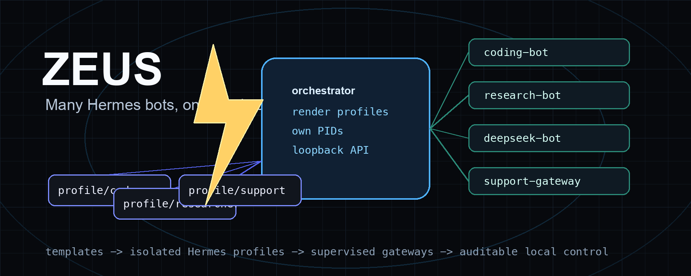
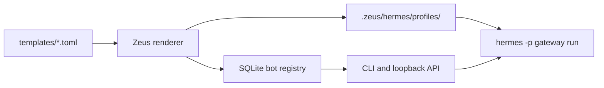

<p align="center">
  
</p>

# Zeus Hermes Orchestrator

Many Hermes bots, one local supervisor.

[](https://github.com/brainx/zeus/actions/workflows/ci.yml)
[](pyproject.toml)
[](LICENSE)
[](https://github.com/brainx/zeus/releases)
[](.github/workflows/ci.yml)
[](SECURITY.md)

Zeus is a orchestration layer for running many Hermes Agent bots from reusable templates. It renders each bot as an isolated Hermes profile under `.zeus/`, starts and stops gateway processes, tracks PID ownership, and exposes a small loopback CLI/API for operators.

## Why Zeus

- Run multiple Hermes bots from one workspace without hand-copying profile directories.
- Stamp out repeatable bot shapes from TOML templates: coding, research, support, DeepSeek, and custom profiles.
- Keep secrets out of templates by rendering per-profile `.env` files that stay ignored by git.
- Supervise gateway processes with ownership markers before stop/status actions trust a PID.
- Account for Hermes async delegation with explicit `max_async_children` caps in every built-in template.
- Verify locally, against a real Hermes install, or on a clean Debian/Ubuntu VPS using included scripts.

## How It Works



Each rendered profile contains `config.yaml`, `.env`, `SOUL.md`, `mcp.json`, `cron/jobs.json`, and logs. Hermes remains the agent runtime; Zeus owns profile generation, local orchestration, lifecycle checks, and handoff verification.

## Quick Start

```bash
python3 -m venv .venv
. .venv/bin/activate
pip install -e .
cp .env.example .env

zeus doctor
zeus template list
zeus bot create coder --template coding-bot
zeus bot doctor coder
```

Start the local API with an explicit key:

```bash
ZEUS_API_KEY=change-me sh scripts/start.sh
```

## 60-Second Demo

The asciinema recording in [docs/assets/demo.cast](docs/assets/demo.cast) mirrors the local
operator flow:

```bash
zeus doctor
zeus template list
zeus bot create coder --template coding-bot
zeus bot start coder
zeus bot status coder
zeus bot logs coder
zeus bot stop coder
```

## Documentation

- [Architecture](docs/ARCHITECTURE.md)
- [API reference](docs/API.md)
- [Template authoring](docs/TEMPLATE_AUTHORING.md)
- [Real Hermes verification](docs/REAL_HERMES_VERIFICATION.md)
- [Fresh VPS test](docs/FRESH_VPS_TEST.md)
- [Systemd deployment](docs/SYSTEMD.md)
- [Operations](docs/OPERATIONS.md)
- [Reconcile scheduling](docs/RECONCILE.md)
- [Release process](docs/RELEASE.md)
- [Repository generation checklist](docs/REPO_GENERATION.md)
- [Roadmap](docs/ROADMAP.md)
- [Contributing](CONTRIBUTING.md)
- [Credits](CREDITS.md)
- [Security policy](SECURITY.md)

Zeus is maintained by [BrainX](https://github.com/brainx). See [Credits](CREDITS.md) for project ownership.

## Requirements

- Python 3.11 or newer
- Hermes Agent installed as `hermes` for real bot startup
- Optional Docker or another Hermes terminal backend for stronger execution isolation

No Python package dependencies are required for the current MVP.

## Setup

```bash
python3 -m venv .venv
. .venv/bin/activate
pip install -e .
cp .env.example .env
```

## Install Modes

Zeus can run from a git checkout or from a built wheel.

- Git checkout: templates are loaded from `templates/*.toml` first.
- Installed package: bundled templates are loaded from `zeus.bundled_templates` when no local template directory is present.
- Custom operators can supply their own `templates/` directory in the active workspace.

## Commands

```bash
zeus doctor
zeus template list
zeus template list --json
zeus bot create coder --template coding-bot
zeus bot create coder-json --template coding-bot --json
zeus bot doctor coder
zeus bot start coder
zeus bot status coder
zeus bot logs coder
zeus bot logs coder --json
zeus bot reconcile coder
zeus bot reconcile --json
zeus bot restart coder
zeus bot stop coder
```

## Verification

Run the local checks:

```bash
sh scripts/test.sh
sh scripts/repo_check.sh
sh scripts/wheel_smoke.sh
```

Run deployment-style diagnostics:

```bash
zeus doctor --strict
```

Strict mode requires a real `hermes` executable on `PATH`.

When Hermes is installed, run the real-Hermes compatibility check:

```bash
sh scripts/verify_real_hermes.sh
```

That script creates an isolated `.zeus-real-hermes-check/` runtime, renders a bot profile, runs `hermes -p <bot> doctor`, and verifies the generated profile contains the async delegation cap. It does not start a gateway by default. To exercise `hermes gateway run`, set:

```bash
ZEUS_VERIFY_START_GATEWAY=1 sh scripts/verify_real_hermes.sh
```

For a clean Debian/Ubuntu host, use the fresh VPS harness:

```bash
ZEUS_VPS_INSTALL_PACKAGES=1 ZEUS_VPS_INSTALL_HERMES=1 bash scripts/fresh_vps_verify.sh
```

See [Fresh VPS test](docs/FRESH_VPS_TEST.md) for gateway and async-delegation probes.

## API

```bash
ZEUS_API_KEY=change-me sh scripts/start.sh
```

The API binds to `127.0.0.1:4311` by default. Every endpoint except `GET /health`
requires `x-zeus-api-key`. If `ZEUS_API_KEY` is not configured, non-health endpoints
reject requests instead of running anonymously. For local-only development, set
`ZEUS_ALLOW_UNAUTH_READS=1` to allow unauthenticated `GET` endpoints while keeping
mutations locked behind `ZEUS_API_KEY`.

The OpenAPI contract is published at [docs/openapi.json](docs/openapi.json).
API errors return an `error.code`, `error.message`, and `error.status` object.

Useful endpoints:

- `GET /health`
- `GET /doctor`
- `GET /templates`
- `GET /bots`
- `POST /bots`
- `POST /bots/<bot-id>/start`
- `POST /bots/<bot-id>/reconcile`
- `POST /bots/<bot-id>/restart`
- `POST /bots/<bot-id>/stop`

## Templates

Templates live in `templates/*.toml`. They render Hermes `config.yaml`, `.env`, `SOUL.md`, `mcp.json`, and `cron/jobs.json` files under `.zeus/hermes/profiles/<bot-id>/`.
Installed wheels fall back to packaged copies of the built-in templates when no
local `templates/` directory is present.
Rendered `.env` values are serialized with quoting when needed so whitespace, `#`,
quotes, and backslashes cannot create extra assignments.

Built-in templates include OpenRouter-backed bots and `deepseek-coding-bot`, which uses Hermes' native DeepSeek provider with `DEEPSEEK_API_KEY`. Example templates also cover gateway operations, log triage, and documentation writing.

Each template should set a bounded async delegation cap:

```toml
[hermes.delegation]
max_async_children = 3
max_concurrent_children = 3
child_timeout_seconds = 0
```

Hermes `delegate_task(background=true)` runs child agents in the background and reinjects results into the originating conversation. Zeus configures capacity and supervises the gateway process; it does not poll Hermes background subagents directly.

## Operational Checks

Run:

```bash
zeus doctor
zeus doctor --json
zeus doctor --strict
```

The doctor validates Python support, Hermes binary availability, template validity, runtime ignore rules, script executability, API bind safety, and rendered bot profile files. Missing Hermes is reported as a warning in normal mode because templates and profile generation can still be developed without a local Hermes install. Use `--strict` for deployment gates where warnings should fail the command.

## Process Safety

When Zeus starts a gateway, it writes a PID ownership marker under the bot profile logs directory. `zeus bot stop` sends SIGTERM only when that marker matches the expected bot, PID, and launch command. On Linux, Zeus also compares the live process command line from `/proc/<pid>/cmdline` before trusting the PID, then waits for graceful gateway shutdown so Hermes can interrupt any running background delegations.

Bots default to manual restart policy. Create a bot with `--restart-policy on-failure`
plus `--restart-backoff-seconds` and `--restart-max-attempts` to let
`zeus bot reconcile [bot-id]` restart unexpectedly stopped gateways with exponential
backoff.

For unattended recovery, install `systemd/zeus-reconcile.service` and
`systemd/zeus-reconcile.timer`. Lifecycle mutations append structured audit
events to `$ZEUS_STATE_DIR/logs/audit.jsonl`.

The test suite includes a fake Hermes executable that exercises the real Zeus subprocess path: render profile, start gateway, verify `HERMES_HOME`, stop gateway, reap the child process, and confirm logs are captured.

## Security Notes

Templates must not contain real secrets. Use environment variables or rendered per-profile `.env` files excluded from git. Hermes profiles isolate Hermes state, not host filesystem access. Use a sandboxed Hermes terminal backend when a bot should not execute tools directly on the host.

Hermes child processes receive a minimal host environment by default plus the
rendered profile `.env`. Set `ZEUS_ENV_PASSTHROUGH=HTTP_PROXY,HTTPS_PROXY,NO_PROXY`
only when a bot needs selected host variables.
