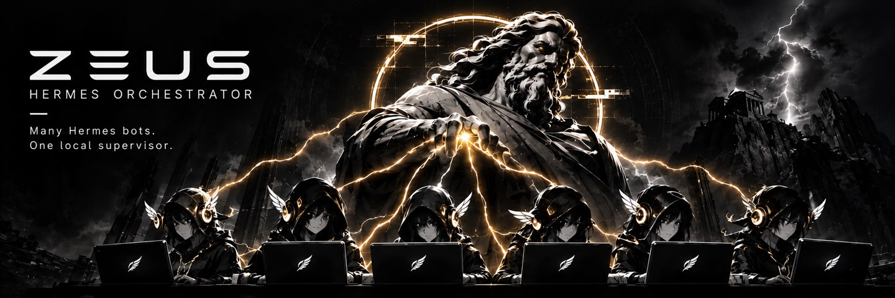
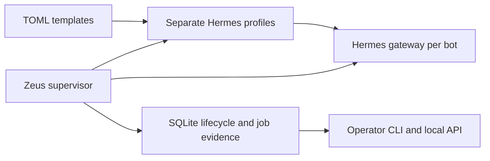

<p align="center">
  
</p>

# Zeus Hermes Orchestrator

**Many Hermes bots, one local supervisor.**

[](https://github.com/brainx/zeus/actions/workflows/ci.yml)
[](pyproject.toml)
[](LICENSE)
[](https://github.com/brainx/zeus/releases)

[Quick start](#quick-start) · [Documentation](#documentation) · [API](docs/API.md) · [Roadmap](docs/ROADMAP.md) · [Security Policy](SECURITY.md)

Zeus is an independent orchestration layer for running multiple
[Hermes Agent](https://hermes-agent.nousresearch.com/) bots on one machine.
Create isolated profiles from templates, manage gateway processes, and inspect
what happened through durable job receipts and lifecycle history.
Hermes Agent, developed by [Nous Research](https://nousresearch.com/), runs the agents.
Zeus manages their local operation.

**Status: alpha.** Python 3.11+; no required third-party Python runtime dependencies.
The offline demo needs no Hermes installation, Docker, or provider credentials.
For real bots, use the tested Hermes baseline and platform guidance in the
[compatibility policy](docs/COMPATIBILITY.md). Pin versions for automation.

## Why Zeus

| What you need | What Zeus provides |
| --- | --- |
| Several bots with different roles | Reusable TOML templates and separate Hermes profiles for coding, research, support, and custom work. |
| Predictable local operations | Start, stop, restart, and reconcile gateways with process-ownership checks, lifecycle locks, and bounded recovery. |
| A record of what happened | Durable job receipts, lifecycle history, reconciliation results, and fleet views with observation age and attention reasons. |
| Evidence for repository reviews | Opt-in audits of committed source, with stored reports and a local evidence-based release gate. |

## Quick Start

### 1. Credential-free offline demo

From a checkout, install Zeus and try its local lifecycle:

```bash
python3 -m venv .venv
. .venv/bin/activate
python -m pip install -e .

zeus demo up
zeus demo status
zeus demo down
```

This uses the packaged fake-Hermes executable to exercise real profile rendering
and process management. It performs no AI tasks and contacts no provider.
`demo down` stops the demo bot; its local state remains under `ZEUS_STATE_DIR`
(workspace-local `.zeus/` by default).

### 2. Real Hermes setup

Install the supported Hermes runtime following the
[compatibility guide](docs/COMPATIBILITY.md), then prepare a private secret file:

```bash
hermes --version
if [ ! -e .env ] && [ ! -L .env ]; then
  cp .env.example .env
fi
chmod 0600 .env
```

Add a real, non-empty provider key to `.env` before continuing. The `coding-bot`
template requires `OPENROUTER_API_KEY`; `.env.example` contains empty placeholders.
You can also supply the named secret through the process environment.

```bash
zeus doctor
zeus template list
zeus bot create coder --template coding-bot --env-from OPENROUTER_API_KEY
zeus bot doctor coder
```

This prepares a profile. Configure a Hermes messaging platform before starting
its gateway, or follow the opt-in [operator messaging setup](docs/MESSAGING.md)
to submit explicit jobs. The [real Hermes verification guide](docs/REAL_HERMES_VERIFICATION.md)
also covers an isolated loopback gateway check.

`--env-from` imports the named value from the process environment, then the
trusted workspace `.env`, without putting the secret in command arguments.
A present but empty environment value is an error. Keep `.env` private and
excluded from Git. Read the [operations guide](docs/OPERATIONS.md) before
running bots unattended.

## How It Works


```mermaid
flowchart LR
  T["TOML templates"] --> P["Separate Hermes profiles"]
  Z["Zeus supervisor"] --> P
  Z --> H["Hermes gateway per bot"]
  P --> H
  Z --> S["SQLite lifecycle and job evidence"]
  S --> O["Operator CLI and local API"]
```

Profiles live under `.zeus/hermes/profiles/<bot-id>/` and contain `config.yaml`,
`.env`, `SOUL.md`, `mcp.json`, and `cron/jobs.json`, with logs alongside them.
Hermes owns agent execution and tools. Zeus owns profile generation, gateway
lifecycle, and local operational evidence.

Bundled templates and workspace `templates/*.toml` are loaded together.
Custom template IDs must be unique; exact mirrors of bundled templates are
accepted in source checkouts. Built-ins cover OpenRouter-backed bots,
`deepseek-coding-bot`, `kimi-k3-coding-bot`, and an opt-in `message-bot`.
See [template authoring](docs/TEMPLATE_AUTHORING.md) for providers, secret imports,
and bounded async delegation.

## Everyday Operations

For a configured bot named `coder`:

| Task | Command |
| --- | --- |
| Check its recorded and observed state | `zeus bot status coder` |
| Read recent logs | `zeus bot logs coder` |
| Inspect its lifecycle history | `zeus bot history coder --limit 50` |
| Request a live health observation | `zeus bot diagnostics coder --json` |
| Restart the gateway | `zeus bot restart coder` |
| Apply its configured recovery policy | `zeus bot reconcile coder` |
| Find bots needing attention | `zeus fleet status --attention-only --json` |

Live diagnostics require a launch-recorded loopback Hermes API and its private
key. See [gateway diagnostics](docs/OPERATIONS.md#live-gateway-diagnostics).
Bot JSON exposes `desired_state` and `converged`; a started process is not
automatically proof that a bot task will succeed.

## Operator Evidence

Explicit jobs use `zeus message send/retry/status/cancel/release/list/capacity/archive`.
The opt-in `message-bot` template sets finite turn and concurrency limits.
Durable receipts preserve submission intent and help operators resolve uncertain
outcomes. Follow the [messaging guide](docs/MESSAGING.md) for setup, capacity,
retries, cancellation, and receipt retention.

Read existing reconciliation evidence without starting another pass:

```bash
zeus reconcile list --limit 20
zeus reconcile show <run-id> --limit 20 --json
zeus fleet status --attention-only --json
```

Fleet observations describe persisted reconciliation evidence, with timestamps
and freshness labels. They perform no live health probe. Results are paginated;
use the returned cursor to continue. See [reconciliation](docs/RECONCILE.md).

## Zeus and Olymp

| Project | Responsibility |
| --- | --- |
| [Hermes Agent](https://github.com/NousResearch/hermes-agent) | Agent runtime, tools, conversations, and delegation. |
| **Zeus** | Profiles, owned gateway processes, recovery, and evidence on one host. |
| [Olymp](https://github.com/brainx/olymp) | Separate cross-host coordination, rollout policy, and approvals. |

Zeus exposes a local JSON API that dashboard backends and Olymp can consume.
Keep credentials in the backend, and check version compatibility before enabling
controls. See the [roadmap](docs/ROADMAP.md) for planned work and project scope;
this repository does not ship a web dashboard.

## API

Provide `ZEUS_API_KEY` through your private service environment, then start:

```bash
sh scripts/start.sh
```

The default address is `127.0.0.1:4311`. All non-health endpoints require
`x-zeus-api-key` by default. The local-development unauthenticated-read option
does not unlock sensitive diagnostics or mutations.

| Surface | Examples |
| --- | --- |
| Health and readiness | `GET /health`, `GET /ready` |
| Inventory and templates | `GET /bots`, `GET /templates` |
| Persisted monitoring | `GET /fleet`, `GET /reconcile/runs`, `GET /reconcile/runs/<run-id>` |
| Bot evidence | `GET /bots/<bot-id>/history`, `GET /bots/<bot-id>/diagnostics` |
| Lifecycle controls | Create, start, stop, restart, and reconcile bots. |

Routes also accept `/v1`. Mutations support an optional durable `Idempotency-Key`;
unresolved prior attempts return `idempotency_indeterminate` instead of being
silently repeated. This guarantee is local and retention-bounded.
Monitoring clients should use persisted evidence: the bot `status` endpoint
can recover pending lifecycle state and is not a side-effect-free read.

See the [API reference](docs/API.md) and [OpenAPI contract](docs/openapi.json)
for authentication, pagination, timeouts, errors, and retry behavior.

## Repository Audit

`zeus audit` reviews the exact committed `HEAD` and stores private reports.
It does not inspect dirty or untracked worktree content, edit source, or deploy
changes. Cross-host scheduling and policy remain outside Zeus.

### Initialize

`zeus audit init` creates the private Kimi K3 configuration without storing a
credential or contacting a provider. An existing configuration is never replaced.

### Check readiness

```bash
zeus audit doctor
```

This non-mutating preflight checks Docker, Hermes Agent 0.21.0, provider credentials,
and a preloaded digest-qualified image. It creates no run and downloads nothing.

### Run an audit

```bash
zeus audit run
```

Audits require those prerequisites and may send selected committed-source excerpts
and bounded terminal output to the configured model provider. Repository commands
run in validated Docker containers with networking disabled; the host Hermes
process still contacts the provider. The private configuration can select another
explicit lowercase Hermes provider and model. Review the
[audit configuration and trust boundaries](docs/AUDIT.md) before running.

### Read stored reports

```bash
zeus audit list
zeus audit show <run-id>
zeus audit gate <run-id>
```

These commands do not invoke Docker, Hermes, provider credential, or image
readiness checks. The local `release-v1` gate requires a complete report matching
the current commit, trusted coverage for every required control, and no high or
critical findings. The default configuration authorizes no coverage commands and
cannot pass this gate by itself. A completed audit is evidence within its recorded
scope, not proof that the repository is secure. See the [audit guide](docs/AUDIT.md).

## 60-Second Demo

The [recorded terminal walkthrough](docs/assets/demo.cast) illustrates the operator
flow. It is a historical recording, not a current compatibility result. Use the
offline quick start above for a runnable demonstration, or the
[real Hermes verification guide](docs/REAL_HERMES_VERIFICATION.md) for live checks.

## Known Limitations

- Zeus is a local process orchestrator, not a sandbox. Separate profiles isolate
  Hermes state; use a sandboxed Hermes terminal backend for untrusted tasks.
- Do not expose the API directly to a network. Keep it on loopback or behind a
  separately hardened access layer. Shared multi-user administration is outside
  the current safety model.
- Zeus supervises the gateway PID, not every tool process an agent may start.
  Live process introspection varies by operating system.
- Protect the state directory, profile secrets, logs, and audit reports. Audits
  can share source excerpts with the configured provider.
- Pre-1.0 interfaces and state schemas may change. Pin versions and read upgrade
  notes; a successful local check does not establish every platform or provider.

## Documentation

| Goal | Guide |
| --- | --- |
| Understand the design | [Architecture](docs/ARCHITECTURE.md) · [Roadmap](docs/ROADMAP.md) |
| Configure bots | [Template authoring](docs/TEMPLATE_AUTHORING.md) · [Messaging](docs/MESSAGING.md) |
| Operate and recover | [Operations](docs/OPERATIONS.md) · [Reconcile scheduling](docs/RECONCILE.md) |
| Integrate a dashboard or service | [API reference](docs/API.md) · [OpenAPI](docs/openapi.json) |
| Review committed source | [Repository audits](docs/AUDIT.md) |
| Verify runtime compatibility | [Compatibility policy](docs/COMPATIBILITY.md) · [Real Hermes verification](docs/REAL_HERMES_VERIFICATION.md) |
| Deploy on Linux | [Systemd deployment](docs/SYSTEMD.md) · [Fresh VPS test](docs/FRESH_VPS_TEST.md) |
| Contribute or package | [Contributing](CONTRIBUTING.md) · [Release process](docs/RELEASE.md) · [Changelog](CHANGELOG.md) |

For development, install the optional `dev` dependencies as described in
[Contributing](CONTRIBUTING.md), then run `make check`. The
`sh scripts/wheel_smoke.sh` command checks an installed package; live Hermes
and Docker verification have separate prerequisites documented in their guides.

Zeus is maintained by [BrainX](https://github.com/brainx).
[MIT license](LICENSE) · [Credits](CREDITS.md) · [Code of conduct](CODE_OF_CONDUCT.md) · [Security policy](SECURITY.md)
